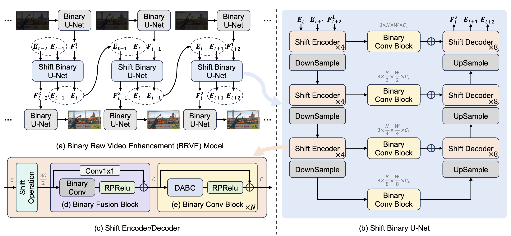

# Binarized Low-light Raw Video Enhancement

This repository contains the official implementation of the following paper:

> Gengchen Zhang, [Yulun Zhang](https://yulunzhang.com/), [Xin Yuan](https://en.westlake.edu.cn/faculty/xin-yuan.html) and [Ying Fu](https://ying-fu.github.io/index.html). "Binarized Low-light Raw Video Enhancement", In *CVPR*, 2024.

## 🎥 Demo

<p align="center">   </p>

## 📖 Introduction

In this work, we design a binary raw video enhancement model (BRVE). It can achieve satisfactory results with low memory and computation cost.

<p align="center">  </p>

Our BRVE has two main innovations:

- An easy-to-binarize spatial-temporal shift operation

- A distribution-aware binary convolution (DABC)

## 🛠️ Installation

**Create conda pytorch environment**
```
conda create -n BRVE python=3.7
conda activate BRVE
conda install pytorch=1.11 torchvision cudatoolkit=11.3 -c pytorch
```

**Install mmcv**
```
pip install openmim
mim install mmcv-full==1.6.0
```

**Setup mmedit with BRVE**
```
git clone https://github.com/zhanggengchen/BRVE.git
cd BRVE
pip install -v -e .
```

**Install dependencies**
```
pip install -r requirements/brve.txt
```

## 💻 Usage

### Prepare Datasets

**Download datasets**

Create the folder to place datasets.

```
mkdir datasets
```

The LLRVD dataset can be downloaded from [Baidu Disk](https://pan.baidu.com/s/1b-BU7ZKOm_k7374quZ5Zgw?pwd=xydx) (code: xydx).

The SMOID dataset is currently not available in this repository.

Directly download datasets to `datasets/` or use symbolic link.

```
ln -s path_to_LLRVD datasets/LLRVD
ln -s path_to_SMOID datasets/SMOID
```

<details close>
<summary><b> Datasets should be organized as follows (Click to expand) : </b></summary>

```
    |--datasets
    |    |--LLRVD
    |    |    |--ISP_info
    |    |    |    |--1
    |    |    |    |    |--1.npy
    |    |    |    |    |--2.npy
    |    |    |    |     ...
    |    |    |    |--2
    |    |    |    |    |--1.npy
    |    |    |    |    |--2.npy
    |    |    |    |     ...
    |    |    |     ...
    |    |    |--ratio_gt
    |    |    |    |--1
    |    |    |    |    |--gt.npy
    |    |    |    |--2
    |    |    |    |    |--gt.npy
    |    |    |     ...
    |    |    |--ratio_noisy_all
    |    |    |    |--1
    |    |    |    |    |--125
    |    |    |    |    |    |--lq.npy
    |    |    |    |    |--160
    |    |    |    |    |    |--lq.npy
    |    |    |    |    |--250
    |    |    |    |    |    |--lq.npy
    |    |    |    |--2
    |    |    |    |    |--100
    |    |    |    |    |    |--lq.npy
    |    |    |    |    |--125
    |    |    |    |    |    |--lq.npy
    |    |    |    |    |--200
    |    |    |    |    |    |--lq.npy
    |    |    |     ...
    |    |--SMOID
    |    |    |--_Scene1
    |    |    |    |--Gain0Gain0
    |    |    |    |    |--Bright
    |    |    |    |    |    |--RAW
    |    |    |    |    |    |    |--raw_target.npy
    |    |    |    |    |--Dark
    |    |    |    |    |    |--RAW
    |    |    |    |    |    |    |--raw_input.npy
    |    |    |    |--Gain15Gain0
    |    |    |    |    |--Bright
    |    |    |    |    |    |--RAW
    |    |    |    |    |    |    |--raw_target.npy
    |    |    |    |    |--Dark
    |    |    |    |    |    |--RAW
    |    |    |    |    |    |    |--raw_input.npy
    |    |    |    |--Gain30Gain0
    |    |    |    |    |--Bright
    |    |    |    |    |    |--RAW
    |    |    |    |    |    |    |--raw_target.npy
    |    |    |    |    |--Dark
    |    |    |    |    |    |--RAW
    |    |    |    |    |    |    |--raw_input.npy
    |    |    |--_Scene2
    |    |    |    |--Gain0Gain0
    |    |    |    |    |--Bright
    |    |    |    |    |    |--RAW
    |    |    |    |    |    |    |--raw_target.npy
    |    |    |    |    |--Dark
    |    |    |    |    |    |--RAW
    |    |    |    |    |    |    |--raw_input.npy
    |    |    |    |--Gain15Gain0
    |    |    |    |    |--Bright
    |    |    |    |    |    |--RAW
    |    |    |    |    |    |    |--raw_target.npy
    |    |    |    |    |--Dark
    |    |    |    |    |    |--RAW
    |    |    |    |    |    |    |--raw_input.npy
    |    |    |    |--Gain30Gain0
    |    |    |    |    |--Bright
    |    |    |    |    |    |--RAW
    |    |    |    |    |    |    |--raw_target.npy
    |    |    |    |    |--Dark
    |    |    |    |    |    |--RAW
    |    |    |    |    |    |    |--raw_input.npy
    |    |     ...
```

</details>

### Test

**Prepare pretrained models**

Create the folder to place pretrained models.

```
mkdir pretrained_models
```

The BRVE model trained on LLRVD dataset can be downloaded from [Google Drive](https://drive.google.com/file/d/1D0ehgOPrCzH_DxdGciihBoEvcZ-8G5lu/view?usp=sharing) or [Baidu Disk](https://pan.baidu.com/s/1HH1aH-wGJJ3LJOOc-WSBTg?pwd=4v88) (code: 4v88).

The BRVE model trained on SMOID dataset can be downloaded from [Google Drive](https://drive.google.com/file/d/1FWbj0_XZCAjVHk0t9yez6Mamai3tiBnC/view?usp=sharing) or [Baidu Disk](https://pan.baidu.com/s/16qQ1uhJozcI898hJNz-nzw?pwd=wq1u) (code: wq1u).

Put the downloaded pretrained models to `pretrained_models/`

**Test on the LLRVD dataset**

Run the following command to reproduce the results in Table 1.

```
torchrun --nnodes=1 --node_rank=0 --master_addr="127.0.0.1" --nproc_per_node=1 --master_port=29500 tools/test.py configs/BRVE_LLRVD.py pretrained_models/BRVE_LLRVD.pth --seed 0 --out test_results/BRVE_LLRVD/result.json --save-path test_results/BRVE_LLRVD --launcher pytorch
```

**Notes**

Set `--nproc_per_node=2` to use 2 GPUs for distributed test.

The path to configuration file `configs/BRVE_LLRVD.py` is required.

The path to pretrained model `pretrained_models/BRVE_LLRVD.pth` is required.

The path to save the quantitative results is specified by `--out test_results/BRVE_LLRVD/result.json`.

The path to save enhanced frames and videos is specified by `--save-path test_results/BRVE_LLRVD`. The argument `--save-path` is optional.

**Test on the SMOID dataset**

Run the following command to reproduce the results in Table 1.

```
torchrun --nnodes=1 --node_rank=0 --master_addr="127.0.0.1" --nproc_per_node=1 --master_port=29500 tools/test.py configs/BRVE_SMOID.py pretrained_models/BRVE_SMOID.pth --seed 0 --out test_results/BRVE_SMOID/result.json --save-path test_results/BRVE_SMOID --launcher pytorch
```

**Notes**

Set `--master_port=29501` if there is a test process running on port `29500`.

### Train

**Train on the LLRVD dataset**

```
torchrun --nnodes=1 --node_rank=0 --master_addr="127.0.0.1" --nproc_per_node=1 --master_port=29500 tools/train.py configs/BRVE_LLRVD.py --seed 0 --launcher pytorch
```

**Train on the SMOID dataset**

```
torchrun --nnodes=1 --node_rank=0 --master_addr="127.0.0.1" --nproc_per_node=2 --master_port=29500 tools/train.py configs/BRVE_SMOID.py --seed 0 --launcher pytorch
```

**Notes**

We use 2 GPUs to train BRVE model on SMOID dataset.

**Evaluating the complexity of BRVE**

We input a video with 100 frames and a resolution of $256 \times 256$ (in Bayer pattern, $4 \times 256 \times 256$ after packing) to evaluate the complexity of BRVE.

```
python tools/get_flops_bnn.py configs/BRVE_LLRVD.py --shape 100 4 128 128
```

## ❤️ Acknowledgement

Our code is developed based on [BasicVSR++](https://github.com/ckkelvinchan/BasicVSR_PlusPlus), [Shift-Net](https://github.com/dasongli1/Shift-Net) and [MMEditing](https://github.com/open-mmlab/mmagic) (MMagic now).

The implementation of BNN is based on [BBCU](https://github.com/Zj-BinXia/BBCU) and [IRNet](https://github.com/htqin/IR-Net).

We thank these public repositories for their excellent code.

## 🖊️ Citation
```
@article{BRVE_arxiv_2024,
title={Binarized Low-light Raw Video Enhancement}, 
author={Gengchen Zhang and Yulun Zhang and Xin Yuan and Ying Fu},
journal={arXiv preprint arXiv:2403.19944},
year={2024}
}
```